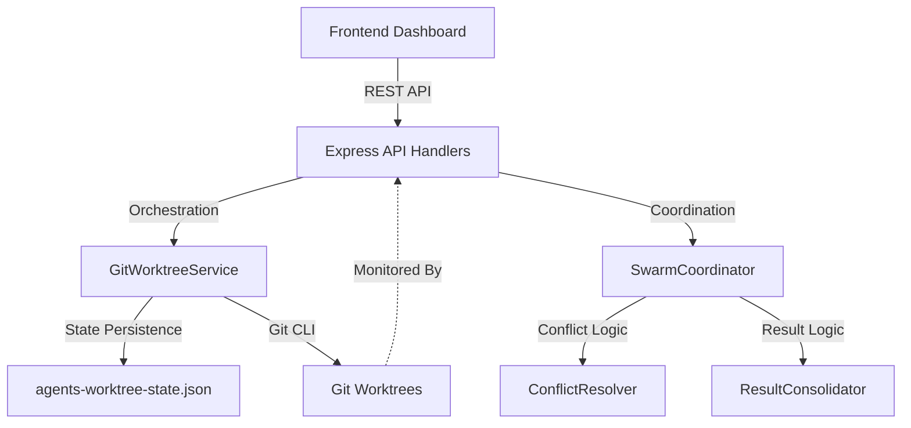

# 🏗️ Agent Worktree API & Architecture

This document details the architectural design and API specifications for the **Agent Manager**, the isolation and orchestration layer of OpenChamber.

## 🗺️ System Architecture

The Agent Manager coordinates the lifecycle of AI agents by isolating their operational context using Git worktrees and sandboxed Node.js processes.



## 🧠 Key Technical Decisions

### 1. JSON Persistence vs. SQLite

**Decision:** Portable JSON File (`~/.config/openchamber/agents-worktree-state.json`)
**Rationale:** Given that OpenChamber is designed as a high-performance local IDE, a lightweight JSON-based state is preferred over a database engine like SQLite. It ensures:

- **Zero Config**: No database setup or migration overhead for end-users.
- **Portability**: State is easily inspectable and backup-friendly.
- **Latency**: File I/O for the agent count (typically < 50) is faster than SQL overhead.

### 2. Custom SVG Visualization vs. React Flow

**Decision:** Direct Matplotlib/D3-inspired SVG Rendering
**Rationale:** To maintain the "Antigravity" aesthetic (Glassmorphism + high FPS), heavy graph libraries were avoided. The SVG graph is calculated on the fly, ensuring minimal bundle size and immediate rendering of hundreds of branching nodes without memory bloat.

### 3. Critical: The `Mutex` and Concurrency

Located in `lib/git-worktree-service.js`, the `Mutex` implementation is vital for **Race-Condition Prevention**.

- **The Problem**: When multiple agents are spawned in parallel, they all attempt to read/write to the central `agents-worktree-state.json` file and invoke `git worktree add`. Without locking, Git commands can clash (e.g., `.git/index.lock` errors) and state corruption occurs.
- **The Solution**: The `runWithLock` wrapper ensures that state updates and Git operations are atomic per repository, allowing the "Chaos Stress Test" (5+ concurrent spawns) to pass with 100% reliability.

---

## 📡 API Reference

### 🚀 Spawn Agent

Creates a new isolated environment and starts the agent process.

**Endpoint:** `POST /api/agents/spawn`

**Request Body:**

```json
{
  "projectDirectory": "/absolute/path/to/project",
  "agentName": "Refactorspecialist",
  "agentType": "specialist",
  "task": "Rewrite the Auth controller to use async/await",
  "branchName": "feature/async-auth",
  "baseBranch": "main"
}
```

**Response (201 Created):**

```json
{
  "success": true,
  "agent": {
    "id": "uuid-v4-string",
    "name": "Refactorspecialist",
    "status": "active",
    "worktreePath": "/path/to/project/.opencode/worktrees/uuid",
    "branchName": "feature/async-auth",
    "createdAt": 1770251153540
  }
}
```

### 📊 Get Agent Status

Retrieve stats and details for all active or historical agents.

**Endpoint:** `GET /api/agents/status`
**Query Params:** `projectDirectory` (optional), `status` (optional), `agentId` (optional)

### 🤝 Consolidate Results

Initiate the merging process for one or more agents.

**Endpoint:** `POST /api/agents/consolidate/:id`

**Request Body:**

```json
{
  "projectDirectory": "/absolute/path/to/project",
  "baseBranch": "main",
  "agentIds": ["agent-uuid-1", "agent-uuid-2"],
  "strategy": "auto"
}
```

_Strategies: `auto`, `manual`, `voting`_

---

## 🧪 Testing Protocol: The Chaotic Stress Test

To maintain the integrity of the isolation layer, all changes to `GitWorktreeService` must pass the **Chaos Stress Test**:

1. **Parallel Spawning**: Simultaneously trigger 5 `POST /spawn` requests targeting the same repository.
2. **Persistence Integrity**: Verify that `agents-worktree-state.json` contains all 5 entries without lost updates.
3. **Worktree Isolation**: Ensure each agent's process environment variables pointing to `GIT_DIR` and `GIT_WORK_TREE` are correctly scoped to their unique UUID directory.
4. **Cleanup**: Verify that `DELETE /api/agents/:id` successfully removes the directory AND the Git worktree metadata.

_Integrity is the foundation of the swarm._
