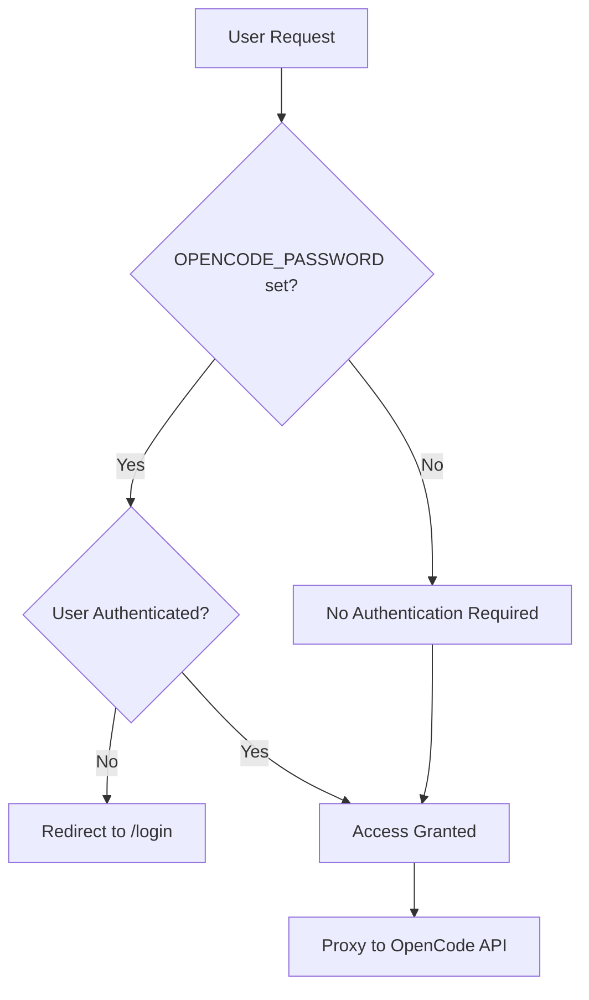

# OpenCode WebUI Authentication Implementation

## Overview

OpenCode WebUI implements **optional session-based authentication** with a manual HTTP proxy for seamless integration with the OpenCode API. Authentication is completely optional - the system works as a public interface without password configuration.

## Architecture

### Core Components

1. **Optional Authentication** - Enabled only when `OPENCODE_PASSWORD` is set
2. **Manual HTTP Proxy** - Custom proxy implementation replacing `http-proxy-middleware`
3. **Session Management** - Express sessions with bcryptjs password hashing
4. **EventSource Support** - Proper streaming for real-time OpenCode communication

### Authentication Flow



## Implementation Details

### 1. Authentication Middleware

**Location**: `server/index.js` lines ~333-400

```javascript
// Authentication setup (optional)
const opencodePassword = process.env.OPENCODE_PASSWORD;
let requiresAuth = false;
let hashedPassword = null;

if (opencodePassword) {
  requiresAuth = true;
  hashedPassword = await bcrypt.hash(opencodePassword, 10);
  console.log('Authentication enabled. Set OPENCODE_PASSWORD environment variable.');
} else {
  console.log('Authentication disabled. To enable, set OPENCODE_PASSWORD environment variable.');
}

// API authentication middleware
app.use('/api', (req, res, next) => {
  // Allow theme endpoints without authentication (WebUI-specific)
  if (req.path.startsWith('/themes/custom')) {
    return next();
  }

  // Require authentication for OpenCode API routes
  if (requiresAuth && !req.session.isAuthenticated) {
    return res.status(401).json({ error: 'Authentication required' });
  }

  next();
});
```

### 2. Manual HTTP Proxy

**Location**: `server/index.js` lines ~148-249

The proxy handles both regular HTTP requests and EventSource streaming:

```javascript
// Manual proxy implementation
app.use('/api', (req, res) => {
  const pathWithoutApi = req.path.replace('/api', '');
  const queryString = new URLSearchParams(req.query).toString();
  const targetPath = `${pathWithoutApi}${queryString ? '?' + queryString : ''}`;

  // Detect EventSource requests
  const isEventSource = req.headers.accept === 'text/event-stream' ||
                        req.headers['accept']?.includes('text/event-stream');

  if (isEventSource) {
    // Handle SSE with Node.js HTTP streaming
    const proxyReq = http.request({
      hostname: 'localhost',
      port: openCodePort,
      path: targetPath,
      method: req.method,
      headers: { ...req.headers, host: `localhost:${openCodePort}` }
    }, (proxyRes) => {
      res.writeHead(proxyRes.statusCode, proxyRes.headers);
      proxyRes.pipe(res);
    });

    // Handle request body and errors...
  } else {
    // Handle regular requests with fetch API
    // Support for different content types and large payloads...
  }
});
```

### 3. Large File Support

**Configuration**: 100MB limit for all request types

```javascript
// JSON parsing with increased limits
app.use(express.json({ limit: '100mb' }));
app.use(express.urlencoded({ extended: true, limit: '100mb' }));
```

### 4. PWA Resource Handling

PWA resources are served through standard `express.static()` without authentication requirements:

- Apple touch icons: `/apple-touch-icon*.png`
- Site manifest: `/site.webmanifest`
- Favicons: `/favicon-*.png` with `/favicon.ico` fallback

## Configuration

### Environment Variables

| Variable | Required | Default | Description |
|----------|----------|---------|-------------|
| `OPENCODE_PASSWORD` | No | - | Enables authentication when set |
| `SESSION_SECRET` | No | `'supersecretkey'` | Session encryption key |

### Usage Examples

**No Authentication** (Public Access):
```bash
# No password set - public access
npm start
```

**With Authentication**:
```bash
export OPENCODE_PASSWORD="your-secure-password"
npm start
```

## API Endpoints

### Authentication Endpoints

- **POST** `/login` - Authenticate with password
- **POST** `/logout` - Clear session
- **GET** `/auth-status` - Check authentication status

### Protected Endpoints

- **ALL** `/api/*` - OpenCode API proxy (except WebUI-specific endpoints)
- Static files when authentication is enabled

### Public Endpoints (Always Accessible)

- `/api/config/agents`, `/api/config/commands` - WebUI agent/command management
- `/api/fs/*`, `/api/git/*` - WebUI file system and git operations
- PWA resources (`/favicon.ico`, `/apple-touch-icon.png`, etc.)
- Authentication endpoints (`/login`, `/logout`, `/auth-status`)

## Key Features

### ✅ Implemented Features

- **Optional Authentication** - Completely disabled without password
- **Session-based Auth** - Secure bcrypt password hashing
- **EventSource Streaming** - Real-time OpenCode communication
- **Large File Support** - 100MB payload limit
- **Query Parameter Support** - Full URL parameter forwarding
- **PWA Compatibility** - iOS PWA icons work without authentication
- **Favicon Fallback** - Automatic `/favicon.ico` → `/favicon-32.png`

### 🔧 Architecture Benefits

- **Simple Setup** - Single environment variable enables/disables auth
- **No Nginx Dependencies** - Self-contained authentication
- **OpenCode Compatibility** - All API features supported
- **Development Friendly** - Works with or without authentication

## Security Considerations

1. **Password Security** - Uses bcrypt with 10 salt rounds
2. **Session Security** - Express sessions with configurable secrets
3. **API Protection** - All OpenCode API endpoints require authentication
4. **Public Resources** - Only essential PWA resources are public

## Troubleshooting

### Common Issues

**EventSource Connection Timeouts**:
- Issue: Manual proxy not handling streaming correctly
- Solution: Verify EventSource detection logic and HTTP streaming setup

**Large File Upload Failures**:
- Issue: 413 Content Too Large errors
- Solution: Increase express.json/urlencoded limits (currently 100MB)

**PWA Icons Not Loading**:
- Issue: Static file serving blocked by authentication
- Solution: PWA resources are served via express.static() before auth middleware

### Debug Logging

The server provides request logging for debugging:
```
[REQUEST] GET /api/session from 192.168.1.1
[API REQUEST] Headers: { ... }
```

## Future Considerations

### When Adding New Features

**No Proxy Changes Needed**:
- New OpenCode API endpoints under `/api/*`
- Standard HTTP methods (GET, POST, PUT, DELETE)
- JSON payloads under 100MB
- Query parameters

**Proxy Changes May Be Needed**:
- New EventSource endpoints (update SSE detection)
- WebUI-specific endpoints (add to auth exclusions)
- Files over 100MB (increase limits)
- Custom content types

---

**Implementation Status**: ✅ Complete and Production Ready
**Last Updated**: September 2025
**Tested With**: OpenCode API v0.11.3, Node.js 22.17.1