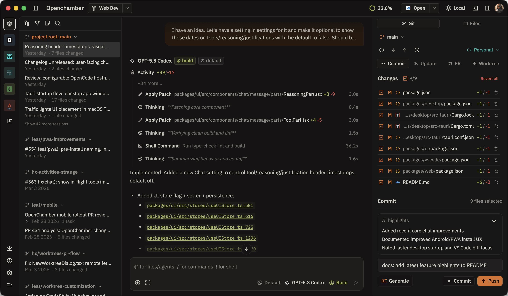
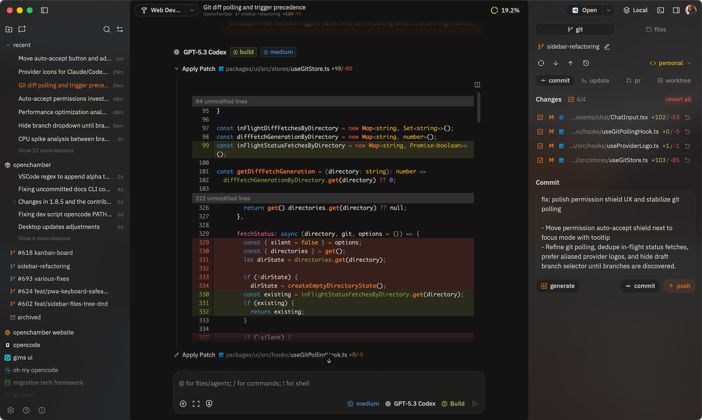
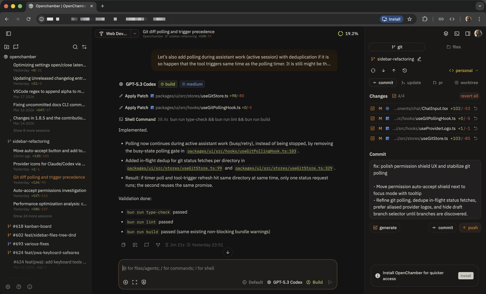
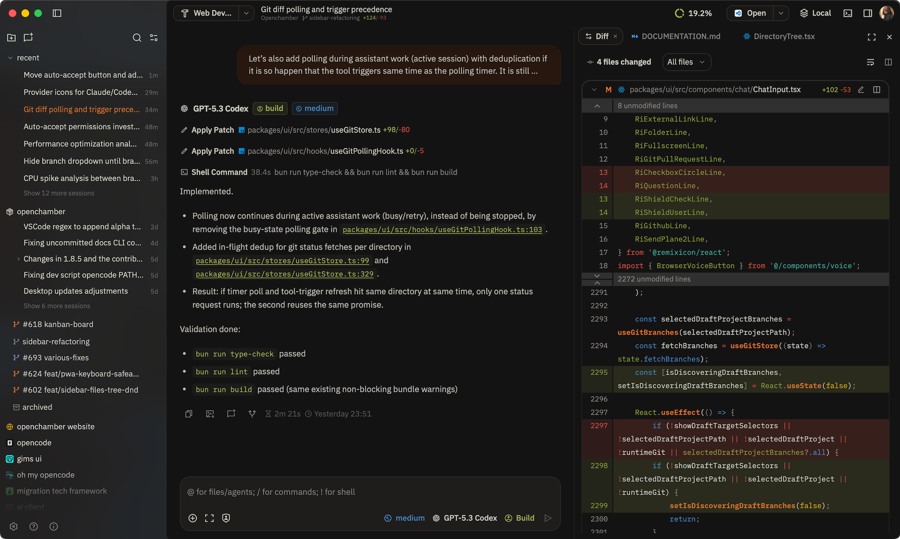
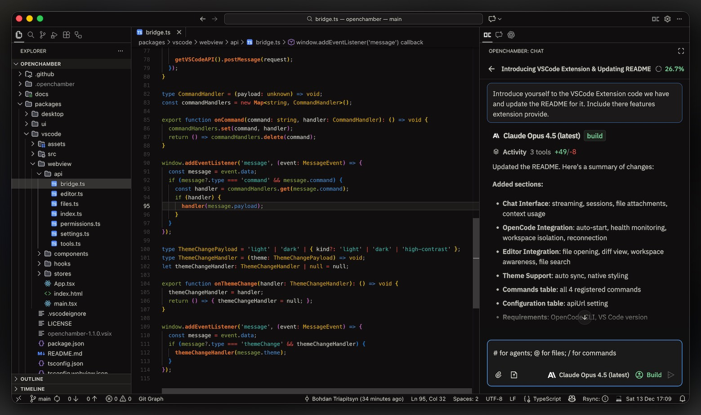
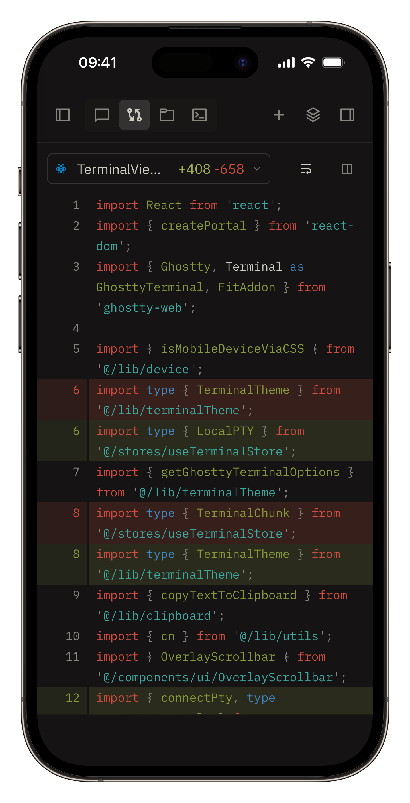

# OpenChamber 仓库指南（简体中文）

## **OpenCode，无处不在。** 桌面端。浏览器。手机端。

### 一个丰富的 [OpenCode](https://opencode.ai) 界面。审查 diff、管理 agents、运行开发服务器，并在 AI 编码时始终掌握全局。



<details>
<summary>更多截图</summary>







<p>


</p>

</details>

## 为什么使用 OpenChamber？

- **跨设备连续性**：在 TUI 中开始，在平板/手机上继续，再回到终端——同一个会话
- **远程访问**：通过浏览器从任何地方使用 OpenCode
- **熟悉感**：为偏好 GUI 工作流的开发者提供一个可视化替代方案

## 功能特性

### 核心功能（所有应用版本）

- 可分叉的聊天时间线，支持 `/undo`、`/redo`，并可从更早的轮次一键分叉
- 面向 diff、文件操作、权限请求和长任务进度的智能工具 UI
- 语音模式，支持语音输入和朗读回复，实现免手操作工作流
- 一条提示并行运行多个 agent，并使用隔离的 worktree 进行安全的并排比较
- 应用内 Git 工作流：身份、提交、PR 创建、检查与合并操作
- GitHub 原生工作流：从 issue 和 pull request 启动会话，并自动附带上下文
- Plan/Build 模式，带有专门的计划视图，用于起草和迭代实现步骤
- 可在 diff、文件和计划中撰写行内评论草稿，并发送回 agent
- 上下文可见性工具（token/成本明细、原始消息检查和活动摘要）
- 内置终端，支持按目录维持会话，并在高输出场景下保持稳定性能
- 内置技能目录和本地技能管理，用于复用自动化工作流

### Web / PWA

- 感知 provider 的 tunnel 访问模型，支持 Cloudflare `quick`、`managed-remote` 和 `managed-local` 模式
- 通过 tunnel 二维码 + 密码 URL 辅助实现一次扫描式引导
- 移动优先体验：优化聊天控件、键盘安全布局以及便于附件操作的 UI
- 后台通知以及可靠的跨标签页会话活动跟踪
- 内置自更新 + 重启流程，同时保留你的 server 设置

### Desktop（macOS）

- 原生 macOS 菜单集成，带更完善的应用操作和 deep-link 处理
- 多窗口支持，用于并行项目/会话工作流
- 面向 Finder、Terminal 和你偏好编辑器的 “Open In” 快捷方式
- 在本地和远程实例之间快速切换
- 以工作区优先的启动流程，带目录选择器和更稳定的窗口恢复行为

### VS Code 扩展

- 编辑器原生工作流：直接从工具输出打开文件，并让会话紧贴代码
- Agent Manager，可从一条提示并行运行多个模型
- 右键操作可添加上下文、解释选区，并原地改进代码
- 扩展内设置、响应式布局，以及与你编辑器一致的主题映射
- 更稳健的运行时生命周期与健康检查，带来更快启动和更少卡住的重连状态

### 自定义主题

- **在任何地方使用它** —— 借助带二维码引导的 Cloudflare tunnel。扫码、连接、在沙发上编码。
- **可分叉聊天时间线** —— 撤销、重做、从任意轮次分叉。在不丢失当前位置的前提下探索不同方案。
- **GitHub 原生工作流** —— 从 issue 和 PR 启动会话，并自动附带上下文。检查、审阅、合并——全部在应用内完成。
- **Project Actions** —— 运行开发服务器、配置 SSH 端口转发、本地打开远程 URL。你的项目命令，一键可用。
- **连接到远程机器** —— 桌面应用通过 SSH 连接到远程 OpenChamber 实例，并带有专门的生命周期与 UX 流程。

## 快速开始

> **前置条件：** 已安装 [OpenCode CLI](https://opencode.ai)。

### **Desktop（macOS）**

从 [Releases](https://github.com/btriapitsyn/openchamber/releases) 下载。

### **VS Code**

从 [Marketplace](https://marketplace.visualstudio.com/items?itemName=fedaykindev.openchamber) 安装，或在扩展中搜索 “OpenChamber”。

### **CLI（Web + PWA）**
_需要 Node.js 20+_

```bash
curl -fsSL https://raw.githubusercontent.com/btriapitsyn/openchamber/main/scripts/install.sh | bash
openchamber --ui-password be-creative-here
```

<details>
<summary>高级 CLI 选项</summary>

```bash
openchamber --port 8080              # 自定义端口
openchamber --ui-password secret     # 为 UI 设置密码保护
openchamber tunnel help              # tunnel 生命周期命令
openchamber tunnel providers         # 显示 provider 能力
openchamber tunnel profile add --provider cloudflare --mode managed-remote --name prod-main --hostname app.example.com --token <token>
openchamber tunnel start --profile prod-main
openchamber tunnel start --provider cloudflare --mode quick --qr
openchamber tunnel start --provider cloudflare --mode managed-local --config ~/.cloudflared/config.yml
openchamber tunnel status --all      # 显示各实例的 tunnel 状态
openchamber tunnel stop --port 3000  # 仅停止 tunnel（server 继续运行）
openchamber logs                     # 跟踪最新实例日志
OPENCODE_PORT=4096 OPENCODE_SKIP_START=true openchamber                    # 连接到外部 OpenCode server
OPENCODE_HOST=https://myhost:4096 OPENCODE_SKIP_START=true openchamber  # 通过自定义 host/HTTPS 连接
openchamber stop                     # 停止 server
openchamber update                   # 更新到最新版本
```

连接到现有的 OpenCode server：

```bash
OPENCODE_PORT=4096 OPENCODE_SKIP_START=true openchamber
OPENCODE_HOST=https://myhost:4096 OPENCODE_SKIP_START=true openchamber
```

将托管的 OpenCode server 绑定到所有接口（仅在可信网络上使用）：

```bash
OPENCHAMBER_OPENCODE_HOSTNAME=0.0.0.0 openchamber --port 3000
```

</details>

<details>
<summary>systemd 服务（VPN / 局域网访问）</summary>

将 OpenChamber 和 OpenCode 作为两个独立的持久服务运行——当你希望通过 VPN（例如 Tailscale）或局域网访问开发机器，而不使用 Cloudflare tunnel 时，这会很有用。

**它是如何工作的：**
- OpenCode 作为独立服务运行，只绑定到 `localhost`。
- OpenChamber 通过 `OPENCODE_HOST` 连接它，而 `--host 0.0.0.0` 会让它在你的 VPN IP 上可达。
- `--foreground` 让 CLI 进程保持存活，以便 systemd 能跟踪并重启它。

**`~/.config/systemd/user/opencode.service`**

```ini
[Unit]
Description=OpenCode Server

[Service]
Type=simple
ExecStart=opencode serve --port 4095
Environment="PATH=/home/linuxbrew/.linuxbrew/bin:/home/linuxbrew/.linuxbrew/sbin:/home/YOU/.local/bin:/home/YOU/.npm-global/bin:/usr/local/bin:/usr/bin:/bin"
Environment=SSH_AUTH_SOCK=%t/ssh-agent.socket
Restart=on-failure
RestartSec=5

[Install]
WantedBy=default.target
```

> **为什么设置 `PATH` 和 `SSH_AUTH_SOCK`？**
> systemd 用户服务在一个最小化环境中启动——不会加载 shell profile。
> 如果没有显式 `PATH`，OpenCode 将找不到通过 Homebrew、npm 或 `~/.local/bin` 安装的工具。
> 如果没有 `SSH_AUTH_SOCK`，通过 SSH 的 git 操作（push、pull、clone）会失败，因为 agent socket 不会被继承。
> 请根据你自己的工具安装路径调整 `PATH`。
> `%t` 会展开为 `$XDG_RUNTIME_DIR`（例如 `/run/user/1000`），多数 SSH agent 会把 socket 写在这里。

**`~/.config/systemd/user/openchamber.service`**

```ini
[Unit]
Description=OpenChamber Web Server
After=opencode.service

[Service]
Type=simple
ExecStart=openchamber serve --port 3000 --host 0.0.0.0 --ui-password your-password --foreground
Environment="OPENCODE_HOST=http://localhost:4095"
Environment="OPENCODE_SKIP_START=true"
Restart=on-failure
RestartSec=5

[Install]
WantedBy=default.target
```

```bash
systemctl --user daemon-reload
systemctl --user enable --now opencode openchamber
```

OpenChamber 将能通过 `http://<your-vpn-hostname>:3000` 从你的 VPN 上任意设备访问。

> **注意：** `--host 0.0.0.0` 是监听所有接口所必需的。默认绑定地址是 `127.0.0.1`（仅 localhost）。如需绑定特定接口，请改用 `--host <ip>` 或 `OPENCHAMBER_HOST=<ip>`。

</details>

<details>
<summary>Docker</summary>

```bash
docker compose up -d
```

可通过 `http://localhost:3000` 访问。

**UI 密码：**

```yaml
environment:
  UI_PASSWORD: your_secure_password
```

**Cloudflare Tunnel（可选）：**

```yaml
environment:
  OPENCHAMBER_TUNNEL_MODE: quick # quick | managed-remote | managed-local
  OPENCHAMBER_TUNNEL_PROVIDER: cloudflare
```

对于 `managed-remote` 模式，需要提供：

```yaml
environment:
  OPENCHAMBER_TUNNEL_MODE: managed-remote
  OPENCHAMBER_TUNNEL_HOSTNAME: app.example.com
  OPENCHAMBER_TUNNEL_TOKEN: <token>
```

对于 `managed-local` 模式，可以提供：

```yaml
environment:
  OPENCHAMBER_TUNNEL_MODE: managed-local
  OPENCHAMBER_TUNNEL_CONFIG: /home/openchamber/.cloudflared/config.yml
```

Managed-local 路径说明：`OPENCHAMBER_TUNNEL_CONFIG` 必须指向容器用户主目录内的路径（`/home/openchamber/...`）。如果你的 Cloudflare 配置引用了 credentials JSON 文件，该文件路径也必须在容器中可访问（通过 `volumes` 挂载）。

### Tunnel 行为说明

- OpenChamber 在每个运行中的实例（端口）上只支持一个活动 tunnel。
- 在同一实例上以不同模式/provider 启动 tunnel 会替换当前 tunnel。
- 替换或停止 tunnel 会撤销现有连接链接，并使该实例的远程 tunnel 会话失效。
- Connect link 是一次性 token；生成新的链接会撤销之前尚未使用的链接。

**数据目录权限说明：** `data/` 目录会挂载到容器中用于持久化存储（配置、会话、SSH 密钥、工作区）。运行前，请确保该目录存在并具有正确权限：

```bash
mkdir -p data/openchamber data/opencode/share data/opencode/config data/ssh
chown -R 1000:1000 data/
```

**SSH/Git：** 如果 git push/pull 失败，请在终端中运行 `ssh -T git@github.com`。

</details>

## 功能特性

<details>
<summary><strong>聊天与交互</strong></summary>

- 可分叉的聊天时间线，支持 `/undo`、`/redo`，并能从任意轮次一键分叉
- 一条提示并行运行多个 agent，并使用隔离的 worktree 安全地进行并排比较
- 语音模式，支持语音输入和朗读回复，实现免手操作工作流
- Plan/Build 模式，带有专门的计划视图，用于起草和迭代步骤
- 可在 diff、文件和计划中撰写行内评论草稿——并将反馈发送回 agent
- 通过前导 `!` 进入 Shell 模式，并查看内联输出
- 将消息分享为图片
- Mermaid 图表内联渲染，并支持复制/下载操作
- 面向 diff、文件操作、权限和任务进度的智能工具 UI

</details>

<details>
<summary><strong>Git 与 GitHub</strong></summary>

- 完整 Git 侧边栏，支持暂存、提交、push/pull、分支管理以及 rebase/merge 流程
- 使用 AI 生成描述的 PR 创建、状态检查和合并操作
- 从 GitHub issue 和 pull request 启动会话，并直接附带上下文
- 多远端 push 和感知 fork 的 PR 创建
- Worktree 集成：每个分支的独立会话，并支持带冲突处理地合并回去
- Git 身份、gitmoji 支持以及多账户 GitHub 认证

</details>

<details>
<summary><strong>文件、Diff 与终端</strong></summary>

- 工作区文件浏览器，支持内联编辑、语法高亮和 Markdown 预览
- 美观的 diff 查看器，支持 stacked/inline 模式，并对大型变更集进行懒加载
- 集成终端，支持按目录维持会话、标签页界面以及稳定的高输出性能
- 消息中的文件路径可点击——可跳转到精确行位置
- 各视图中的文件类型图标，便于更快的视觉扫描

</details>

<details>
<summary><strong>Web / PWA</strong></summary>

- Cloudflare tunnel，支持 quick、managed-remote 和 managed-local 模式，带安全的一次性连接链接和二维码引导
- 移动优先：优化聊天控件、键盘安全布局、项目拖拽重排
- 后台通知与跨标签页会话跟踪
- 自更新 + 重启流程，同时保留你的服务器设置
- 可安装为带项目感知命名的 PWA

</details>

<details>
<summary><strong>Desktop（macOS）</strong></summary>

- 通过 SSH 连接到远程 OpenChamber 实例，并提供专门的生命周期流程
- Project Actions：运行开发服务器、SSH 端口转发、在本地打开远程 URL
- 多窗口支持，用于并行项目工作流
- 面向 Finder、Terminal 和你偏好编辑器的 “Open In” 快捷方式
- 在本地和远程实例之间快速切换
- 原生 macOS 菜单、deep-link 处理以及更精致的启动体验

</details>

<details>
<summary><strong>VS Code 扩展</strong></summary>

- 编辑器原生：从工具输出打开文件，并让会话停留在代码旁边
- Agent Manager，可从一条提示并行运行多个模型
- 右键操作：添加上下文、解释选区、原地改进代码
- 会话编辑器面板、响应式布局，以及与你编辑器匹配的主题映射
- Edit 风格工具结果可直接在聚焦的 diff 视图中打开

</details>

<details>
<summary><strong>自定义能力</strong></summary>

- 18+ 内置主题，带明暗变体
- 通过 `~/.config/openchamber/themes/` 中的 JSON 文件自定义主题——热重载，无需重启
- 可配置聊天、面板和服务的键盘快捷键
- 字体大小、间距、圆角和布局控制
- 可上传和自动发现 favicon 的可定制项目图标
- 技能目录和本地技能管理，用于可复用的自动化

[阅读指南：Custom Themes](../../../../../docs/CUSTOM_THEMES.md)

</details>

<details>
<summary><strong>上下文与生产力</strong></summary>

- Token 使用量、成本明细和原始消息检查面板
- 跨多个 provider 的用量配额跟踪，带 pace/prediction 指标
- 通过键盘快捷键轮换收藏模型
- 支持拖拽重排的会话文件夹与子文件夹
- 每个项目持久化的项目笔记和待办事项
- 每个会话持久化草稿，并带更长提示的扩展专注模式

</details>

## 路线图

正在积极开发中。以下是正在进行或计划中的内容：

- Windows 和 Linux 桌面应用
- 支持远程实例和笔记本连通性的移动应用
- 更多内置 tunneling 选项
- 用于多-agent 管理的看板，让人类始终处于环中并掌控全局
- 内置自定义 OpenCode 插件/工具目录
- Linear 集成
- 运行开发应用并与 agent 集成的内置浏览器

## 致谢

这是一个独立项目，与 OpenCode 团队无关。

**特别感谢：**

- [OpenCode](https://opencode.ai) —— 提供了出色的 API 和可扩展架构。
- [Flexoki](https://github.com/kepano/flexoki) —— [Steph Ango](https://stephango.com/flexoki) 设计的优美配色方案。
- [Pierre](https://pierrejs-docs.vercel.app/) —— 快速、美观并带语法高亮的 diff 查看器。
- [Tauri](https://github.com/tauri-apps/tauri) —— 桌面应用框架。
- [Ghostty-web](https://github.com/coder/ghostty-web) —— 很棒的 Ghostty web renderer 实现。
- [David Hill](https://x.com/iamdavidhill) —— 他启发我不要[想太多](https://x.com/iamdavidhill/status/1993648326450020746)，直接把它发布出来。
- [My wife](https://github.com/yulia-ivashko) —— 她几乎没有 AI 背景，却第一次上手应用就做出了每次 push 成功时播放的烟花庆祝效果。
- 每一位通过 PR、想法和对细节的关注塑造了这个项目的贡献者。

## 参与贡献

开发环境搭建和贡献指南请参见根目录的 [`CONTRIBUTING.md`](../../../../../CONTRIBUTING.md)。

文档源位于 [`packages/docs`](../../../README.md)。

## 许可证

MIT
